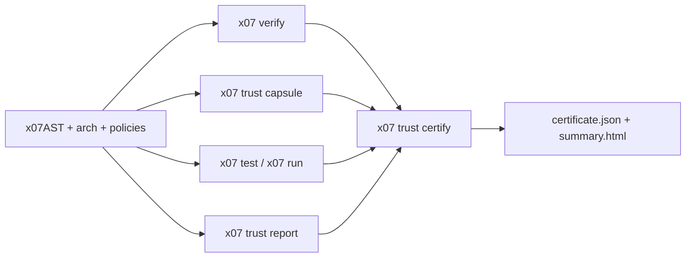

<picture>
  <source media="(prefers-color-scheme: dark)" srcset="branding/logo-full-dark.png">
  <source media="(prefers-color-scheme: light)" srcset="branding/logo-full-light.png">
  
</picture>

# The Language Designed for AI Agents

X07 is a programming language built from the ground up for **100% agentic coding**. Unlike traditional languages where humans write code and AI assists, X07 flips the model: AI agents generate, modify, test, and repair programs reliably—without needing a human to "massage" code.

> **X07 is under active development. APIs and tooling may change.**

**[Documentation](https://x07lang.org)** · [FAQ](https://x07lang.org/docs/faq) · [Support](SUPPORT.md) · [Discord](https://discord.gg/59xuEuPN47) · [Email](mailto:support@x07lang.org) · [Releases](https://github.com/x07lang/x07/releases)

---

## Why X07?

X07 is the core repo and entrypoint for the whole ecosystem. It is the place to start if you want to understand the language, install the toolchain, or build agent-friendly software that can move from local development to browser, device, MCP, package registry, and lifecycle platform workflows without switching languages.

Autonomous agents struggle with mainstream languages because of **multiple equivalent patterns**, **ambiguous diagnostics**, **nondeterministic test environments**, and **text-based patching on fragile syntax**. X07 makes these constraints first-class concerns:

### Machine-First Source Format

The canonical source is **x07AST JSON** (`*.x07.json`), not text files. Patches are structural ([RFC 6902 JSON Patch](https://datatracker.ietf.org/doc/html/rfc6902)), so agents apply changes mechanically—no parsing ambiguity, no whitespace surprises.

### Memory-Safe Defaults

Normal X07 programs work with checked values, bytes, views, and structured data rather than raw pointer arithmetic. Unsafe pointer surfaces are explicit, limited, and outside the standard agent workflow, which keeps day-to-day code generation safer and easier to review.

### Deterministic Execution

X07’s tooling is designed for reproducible, machine-driven repair loops: stable error codes, structured reports, and explicit resource budgets.

### Single Canonical Approach

One way to do each thing. No "should I use a for loop or map?" decisions. This eliminates the pattern confusion that plagues LLM-generated code in flexible languages.

### Machine-Readable Diagnostics

Errors are **structured identifiers with actionable fixes** designed for LLM consumption—not cryptic messages intended for humans to interpret.

### Explicit Capability Worlds

Side effects are opt-in. Programs run in deterministic solve worlds or OS worlds, and sandboxing is explicit and policy-driven.

### Structured Concurrency

X07 gives agents one clear concurrency model: structured task scopes, explicit budgets, and deterministic fixture-world execution. That keeps async code fast enough for real workloads while staying reviewable and testable.

### High Performance

X07 compiles to optimized native code with competitive runtime performance. In the direct-binary benchmarks published in `x07lang/x07-perf-compare` (v0.0.3 snapshot), X07 matched or exceeded C/Rust execution times on the included workloads while compiling ~3x faster than C and ~6-7x faster than Rust. Binary sizes in that snapshot were comparable to C (~34 KiB).

See [`x07lang/x07-perf-compare`](https://github.com/x07lang/x07-perf-compare) for detailed benchmarks.

## Why End Users Care

- **Reliable memory model**: the default language surface avoids the raw-memory pitfalls that make systems code hard to trust.
- **Speed**: X07 targets native execution and competitive runtime performance.
- **Concurrency**: structured concurrency gives you parallel work without orphan-task chaos.
- **Predictable deployment story**: the same ecosystem covers local CLIs, MCP servers, web UI, device apps, WASM backends, package publishing, and lifecycle operations.
- **Simple mental model**: fewer equivalent ways to do the same thing means fewer hidden surprises in code reviews and maintenance.

## Why Coding Agents Work Reliably With X07

- **Canonical source and patching**: x07AST JSON plus JSON Patch avoids fragile text diffs.
- **Stable diagnostics**: agents can key off structured codes and quickfixes instead of guessing from prose.
- **Deterministic worlds and replay**: repair loops can stay reproducible until you explicitly opt into OS effects.
- **Capability boundaries**: tools, runners, and hosts all use explicit contracts for what code is allowed to do.
- **Single official path per capability**: fewer choices means less hallucinated glue code.

## Formal verification & certification

X07 exposes formal verification as a public toolchain surface, not an internal experiment.

- `x07 verify --coverage` emits reachable support posture for planning and review. Coverage is never proof.
- `x07 verify --prove` emits machine-readable proof artifacts for certifiable targets.
- `x07 verify --prove --emit-proof <path>` adds a proof object plus a proof-check report.
- `x07 prove check` independently re-checks emitted proof objects.
- `x07 trust capsule` attests effectful capsule boundaries.
- `x07 pkg attest-closure` freezes the reviewed dependency closure into a deterministic attestation.
- `x07 trust certify` binds the operational entry, per-symbol prove inventory, proof assumptions, tests, boundaries, capsules, dependency closure, peer policies, and runtime evidence into a certificate bundle that reviewers can consume directly.

The current certifiable proof subset includes pure self-recursive `defn` targets when they declare `decreases[]`; proof artifacts expose recursion boundedness explicitly instead of hiding it behind a pass/fail bit.
Imported proof summaries are public artifacts (`x07.verify.proof_summary@0.2.0`): downstream prove runs can reuse them through `x07 verify --proof-summary <path>` or the deprecated `--summary <path>` alias.
Coverage/support summaries are separate posture artifacts (`x07.verify.summary@0.2.0`, `summary_kind = "coverage_support"`) and are rejected anywhere proof evidence is required.
Strong trust profiles certify the operational entry named by `project.operational_entry_symbol`, require per-symbol prove artifacts, reject developer-only imported stubs and coverage-only imports, and bind proof inventory, proof assumptions, proof objects, and proof-check reports directly into the certificate.
Direct prove inputs currently accept unbranded `bytes` / `bytes_view` / `vec_u8`, first-order `option_*` and `result_*`, and schema-derived `bytes_view@brand` documents when the reachable module graph exposes `meta.brands_v1.validate`. That lets proved cores take branded record/tagged-union views directly while keeping validation explicit in the generated driver, and it now admits direct `vec_u8` boundary values without falling back to an unsupported richer-data diagnostic. Owned branded `bytes` and nested result carriers remain outside the current direct prove-input subset.
The networked sandbox certification line is `trusted_program_sandboxed_net_v1`: it requires attested network capsules, pinned peer-policy files, a non-empty runtime allowlist, dependency-closure attestation, and VM-boundary network enforcement in the runtime attestation.
On Linux, the prove/certify lanes are exercised against official `cbmc 6.8.0` and `z3 4.16.0`. The Ubuntu 24.04 `universe` packages (`cbmc 5.95.1`, `z3 4.8.12`) are too old for the async proof/certification line. Use `scripts/ci/install_formal_verification_tools_linux.sh` or the checked-in example workflows instead of relying on distro solver packages.



The public overview, design decisions, and starter paths live in
[`docs/toolchain/formal-verification.md`](docs/toolchain/formal-verification.md).
Use the matching template for the trust claim you want:

- `x07 init --template verified-core-pure`
- `x07 init --template trusted-sandbox-program`
- `x07 init --template trusted-network-service`
- `x07 init --template certified-capsule`
- `x07 init --template certified-network-capsule`

Canonical certificate-first examples live in:

- `docs/examples/verified_core_pure_v1/`
- `docs/examples/trusted_sandbox_program_v1/`
- `docs/examples/trusted_network_service_v1/`
- `docs/examples/certified_capsule_v1/`
- `docs/examples/certified_network_capsule_v1/`

Additional first-party dogfood examples live in `x07-mcp`:

- `x07-mcp/docs/examples/trusted_program_sandboxed_local_stdio_v1/` is the package-backed operational-entry example for the sandboxed local trust profile.
- `x07-mcp/docs/examples/verified_core_pure_auth_core_v1/` is a developer/demo example only because its bearer-parser dependency currently relies on a developer-only imported stub path.

## Ecosystem Overview

X07 is not just a compiler. The public ecosystem is organized into focused repos with one consistent story:

- [`x07lang/x07`](https://github.com/x07lang/x07): the core language, compiler, CLI, stdlib sources, schemas, and canonical docs.
- [`x07lang/x07-mcp`](https://github.com/x07lang/x07-mcp): the MCP kit and the official `io.x07/x07lang-mcp` server for coding and operating X07 systems from agent runtimes.
- [`x07lang/x07-wasm-backend`](https://github.com/x07lang/x07-wasm-backend): the WASM toolchain for pure modules, full-stack app bundles, browser UI, and device packaging.
- [`x07lang/x07-web-ui`](https://github.com/x07lang/x07-web-ui): the official reducer-style web UI contracts and browser host.
- [`x07lang/x07-device-host`](https://github.com/x07lang/x07-device-host): the desktop and mobile WebView host that runs the same X07 UI reducer across platforms.
- [`x07lang/x07-wasi`](https://github.com/x07lang/x07-wasi): canonical `std.wasi.*` packages for WASI-facing X07 programs.
- [`x07lang/x07-platform`](https://github.com/x07lang/x07-platform): the lifecycle platform for sealed artifacts, deploy plans, incidents, regressions, and device releases.
- [`x07lang/x07-platform-contracts`](https://github.com/x07lang/x07-platform-contracts): the public `lp.*` contracts shared by the platform CLI, UI, APIs, and MCP tools.
- [`x07lang/x07-registry`](https://github.com/x07lang/x07-registry): the package registry backend.
- [`x07lang/x07-registry-web`](https://github.com/x07lang/x07-registry-web): the public package registry UI at [x07.io](https://x07.io).
- [`x07lang/x07-website`](https://github.com/x07lang/x07-website): the documentation website at [x07lang.org](https://x07lang.org).

For end users, that means one language with an official path for package distribution, WASM delivery, browser and device UI, MCP-based agent tooling, and production lifecycle control.

---

## Quick Start

### Install

The recommended installer is `x07up` (toolchain manager). It installs the toolchain under `~/.x07/`, configures `~/.x07/bin/` shims, and manages optional runtime components such as `x07-wasm` and `x07-device-host-desktop`.

macOS / Linux:

```bash
curl -fsSL https://x07lang.org/install.sh | sh -s -- --yes --channel stable
```

Windows (WSL2):

X07 is supported on Windows via WSL2 (Ubuntu recommended). In your WSL2 shell, run the macOS / Linux install command above.

Docs: https://x07lang.org/docs/getting-started/installer/

Advanced: toolchain archives are also available under https://github.com/x07lang/x07/releases

Add the WASM and device-host components when you need them:

```bash
x07up update
x07up component add wasm
x07up component add device-host
x07 wasm doctor --json
```

### Run a Program

```bash
mkdir myapp
cd myapp
x07 init
x07 run
```

### Agent Tooling

For the canonical agent loop, start with `x07 run` (auto-repair by default). Use the commands below when you need explicit control over individual repair steps.

```bash
x07 fmt --input program.x07.json --write
x07 lint --input program.x07.json
x07 fix --input program.x07.json --write
x07 ast apply-patch --in program.x07.json --patch patch.json --out program.x07.json --validate
```

### Official MCP server (for agent runtimes)

If your coding agent runtime supports MCP (Model Context Protocol), install and use the official X07 MCP server: `io.x07/x07lang-mcp`. It exposes token-efficient core editing tools plus capability-gated ecosystem tools such as `x07.ecosystem.status_v1`, `x07.pkg.provides_v1`, `x07.wasm.core_v1`, `x07.web_ui.exec_v1`, `x07.device.exec_v1`, `x07.app.exec_v1`, `lp.query_v1`, safe lifecycle control via `lp.control_v1`, and safe patch application for x07AST JSON.

For release-, incident-, and regression-aware clients, keep app-specific candidate/workspace state locally and consume operational truth from the official structured `lp.*` result contracts exposed through `x07lang-mcp`. The x07-side boundary is documented in [`docs/toolchain/mcp-kit.md`](docs/toolchain/mcp-kit.md) and [`docs/agent/platform.md`](docs/agent/platform.md).

For MCP server projects, prefer `x07 init --template mcp-server-http-tasks` when you want the task-aware HTTP/SSE scaffold; `x07` delegates that template to `x07-mcp` rather than re-implementing MCP kit logic locally.

Start here: https://x07lang.org/docs/getting-started/agent-quickstart/ (includes MCP setup).

---

## OS Worlds

| World | Description |
|-------|-------------|
| `run-os` | Real OS access (non-deterministic) |
| `run-os-sandboxed` | Policy-restricted OS access |

---

## Repository Layout

```
x07/
├── docs/           # End-user documentation (x07lang.org source)
├── crates/         # Rust workspace
│   ├── x07c/           # Compiler (X07 → C)
│   ├── x07-host-runner # Deterministic native runner
│   └── x07-os-runner   # OS-world runner backend (canonical entrypoint: `x07 run`)
├── stdlib/         # Standard library
├── ci/             # Release-blocking fixtures + suites
├── labs/           # Optional benchmarks, perf, fuzz, eval tooling
└── scripts/        # Tooling and CI scripts
```

## Key Links

- Docs: [x07lang.org](https://x07lang.org)
- Package registry: [x07.io](https://x07.io)
- MCP kit: [x07lang/x07-mcp](https://github.com/x07lang/x07-mcp)
- WASM tooling: [x07lang/x07-wasm-backend](https://github.com/x07lang/x07-wasm-backend)
- Lifecycle platform: [x07lang/x07-platform](https://github.com/x07lang/x07-platform)
- Official docs site repo: [x07lang/x07-website](https://github.com/x07lang/x07-website)
 
 ---

## Build from Source

Prerequisites: Rust toolchain, C compiler (`cc`), `clang`, Python 3

```bash
# Full CI check
./scripts/ci/check_all.sh

# Individual checks
cargo fmt --check
cargo test
cargo clippy --all-targets -- -D warnings

# Run test harness
cargo run -p x07 -- test --manifest tests/tests.json
```

---

## License

Licensed under either of:

- Apache License, Version 2.0 ([LICENSE-APACHE](LICENSE-APACHE))
- MIT License ([LICENSE-MIT](LICENSE-MIT))
